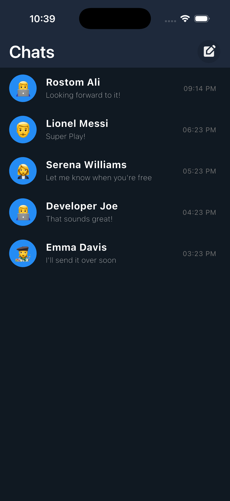
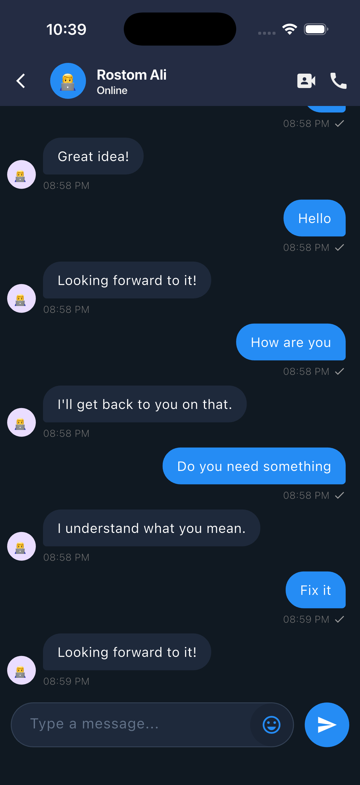
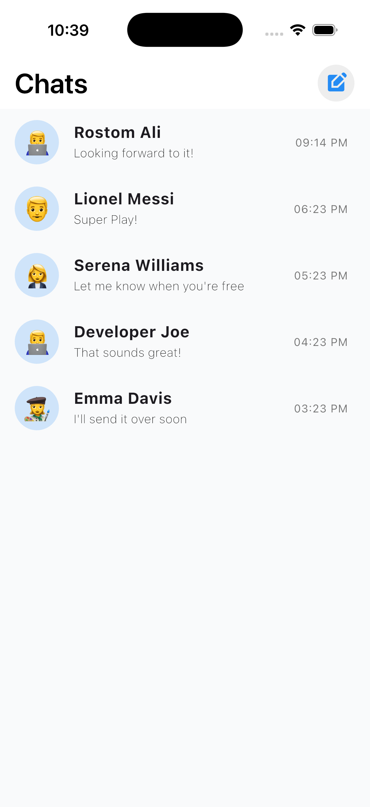
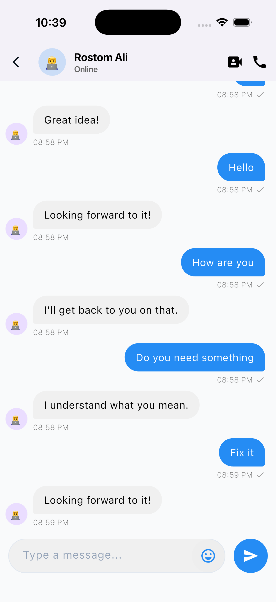

# chat_app

<h1>Chat App</h1>

Offline-first chat app built with Flutter.

<h2>✨ Features</h2>
<ul>
  <li><strong>Offline First</strong> – Fully functional without internet. All messages stored locally using Hive.</li>
  <li><strong>Dummy Replies</strong> – User gets auto-reply from a predefined message list.</li>
  <li><strong>API Simulation</strong> – <code>POST</code> call to <code>https://dummyjson.com/products</code> (GET api used as POST for demo).</li>
  <li><strong>State Management: Bloc</strong>
    <ul>
      <li>Business logic (chat list & conversation) separated from UI.</li>
      <li>UI renders conditionally based on async data (local + remote).</li>
      <li>Optimized rebuilds for better memory & performance.</li>
    </ul>
  </li>
  <li><strong>Error Handling</strong> – All possible errors (network, API, DB) handled gracefully.</li>
</ul>

<h2>📥 Download APK</h2>

<a href="https://drive.google.com/file/d/1JCbPYS3gZp7Cqusa2ErRdoq2crpt11b2/view?usp=sharing">Download from Google Drive</a>

<h2>📸 Screenshots</h2>

  
  
  
  

<h2>🛠️ Tech Stack</h2>
<ul>
  <li>Flutter + Dart</li>
  <li>Bloc (State Management)</li>
  <li>Hive (Local Database)</li>
  <li>dio(Networking)</li>
</ul>

